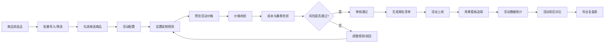

## 1. 产品概述

本产品为中小网店运营人员打造的一站式促销活动管理平台，通过标准化流程提升活动策划效率，降低价格风险，实现数据驱动的精细化运营。
- 目标用户：淘宝/京东/拼多多等平台中小网店运营人员、店长
- 核心价值：简化促销活动从选品到复盘的全流程管理，避免价格亏损，提升活动投入产出比

## 2. 核心功能

### 2.1 用户角色

| 角色 | 注册方式 | 核心权限 |
|------|----------|----------|
| 运营人员 | 手机号注册/企业账号登录 | 商品管理、活动创建与配置、价格审核、数据查看与导出 |
| 店铺管理员 | 企业账号登录 | 多店铺管理、活动审批、数据看板查看、用户权限分配 |

### 2.2 功能模块

1. **商品池页面**：商品导入、店铺筛选、库存筛选、毛利筛选、批量选品
2. **活动配置页面**：活动信息设置、满减折扣配置、赠品设置、活动价预览、提交审核
3. **价格校验页面**：低于成本价检测、优惠券叠加风险检测、审核状态管理、报名清单生成
4. **效果看板页面**：活动日历、核心指标统计、活动前后数据对比、复盘报表导出

### 2.3 页面详情

| 页面名称 | 模块名称 | 功能描述 |
|----------|----------|----------|
| 商品池 | 商品导入 | 支持按店铺批量导入商品（Excel/API），展示商品名称、SKU、价格、库存、成本等信息 |
| 商品池 | 智能筛选 | 支持按店铺、库存区间、毛利区间、价格区间等多维度组合筛选商品 |
| 商品池 | 批量选品 | 支持勾选商品加入活动候选池，可批量操作、全选、反选 |
| 活动配置 | 活动基本信息 | 设置活动名称、时间范围、活动类型（满减/折扣/赠品）、适用平台 |
| 活动配置 | 促销规则配置 | 支持多级满减、阶梯折扣、买赠设置、限购数量等复杂促销规则 |
| 活动配置 | 活动价预览 | 实时计算并展示各商品活动价、优惠幅度、预估利润 |
| 价格校验 | 风险检测 | 自动检测低于成本价商品、优惠券叠加后亏损商品、价格异常商品 |
| 价格校验 | 审核流程 | 支持审核状态流转（待审核/已通过/已驳回），可添加审核备注 |
| 价格校验 | 报名清单 | 一键生成平台活动报名所需的商品清单（Excel导出） |
| 效果看板 | 活动日历 | 日历视图展示所有活动时间线，支持快速跳转查看详情 |
| 效果看板 | 数据统计 | 展示成交额、访客数、转化率、客单价、毛利等核心指标 |
| 效果看板 | 数据对比 | 活动期 vs 非活动期核心指标对比，可视化图表展示 |
| 效果看板 | 复盘导出 | 支持导出完整活动复盘报告（Excel/PDF），包含核心数据与趋势图 |

## 3. 核心流程

## 4. 用户界面设计

### 4.1 设计风格
- **主色调**：深邃商务蓝（#1E40AF），传达专业与信赖感
- **辅助色**：活力橙（#F97316）用于强调操作和警示信息
- **成功色**：森林绿（#059669）用于通过/正常状态
- **警示色**：珊瑚红（#DC2626）用于风险/错误提示
- **按钮风格**：圆角8px，悬停微上浮效果，点击按压反馈
- **字体**：标题使用「思源黑体 Bold」，正文使用「思源黑体 Regular」
- **布局风格**：左右分栏布局，左侧导航 + 右侧内容区，卡片式模块分组
- **图标风格**：线性图标，统一24px尺寸，与文字基线对齐

### 4.2 页面设计概述

| 页面名称 | 模块名称 | UI元素 |
|----------|----------|--------|
| 商品池 | 顶部操作栏 | 店铺下拉选择、导入按钮、筛选条件组、搜索框 |
| 商品池 | 商品列表 | 数据表格，支持排序、分页、行勾选，每行展示商品缩略图、名称、SKU、价格、库存、毛利 |
| 商品池 | 底部操作栏 | 已选商品计数、加入活动按钮、批量操作菜单 |
| 活动配置 | 活动信息卡 | 表单布局，包含活动名称、日期选择器、平台选择、活动描述 |
| 活动配置 | 促销规则卡 | 动态规则添加，支持多档位满减/折扣配置，赠品选择弹窗 |
| 活动配置 | 价格预览卡 | 商品列表，实时计算活动价、优惠金额、毛利率，颜色区分不同优惠力度 |
| 价格校验 | 风险概览卡 | 统计卡片展示风险商品数、低于成本数、叠券风险数 |
| 价格校验 | 风险详情表 | 风险商品列表，标注风险类型、风险值、建议操作 |
| 价格校验 | 审核操作区 | 审核状态标签、通过/驳回按钮、备注输入框、导出清单按钮 |
| 效果看板 | 指标卡片组 | 顶部横向排列核心KPI卡片，带环比变化箭头 |
| 效果看板 | 活动日历 | 月视图日历，活动日期高亮标记，悬浮显示活动摘要 |
| 效果看板 | 数据图表区 | 柱状图（成交额对比）、折线图（转化率趋势）、饼图（商品销售占比） |
| 效果看板 | 导出区域 | 时间范围选择、导出格式选择、导出按钮 |

### 4.3 响应式设计
- **桌面优先**：默认适配1920×1080分辨率，最小支持1280px宽度
- **平板适配**：1024px断点，侧边栏可收起，表格支持横向滚动
- **触控优化**：按钮最小44×44px点击区域，重要操作添加触控反馈
- **移动端**：768px断点，导航转为底部Tab栏，表格转为卡片列表展示

### 4.4 动画与交互
- **页面加载**：骨架屏加载动画，内容区域淡入效果
- **数据更新**：指标变化时数字滚动动画，卡片数据刷新时的平滑过渡
- **风险提示**：风险商品行的呼吸灯效果，高风险项的轻微抖动动画
- **表格交互**：行悬停时背景色变化，选中行的高亮标记动画
- **按钮反馈**：悬停时轻微放大（scale 1.02），点击时的缩放回弹效果
