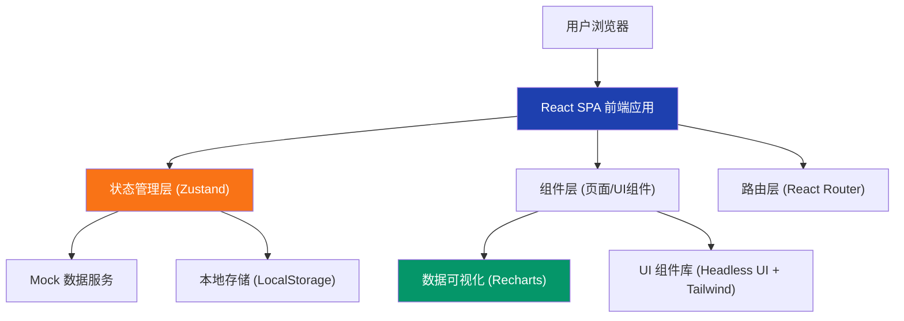
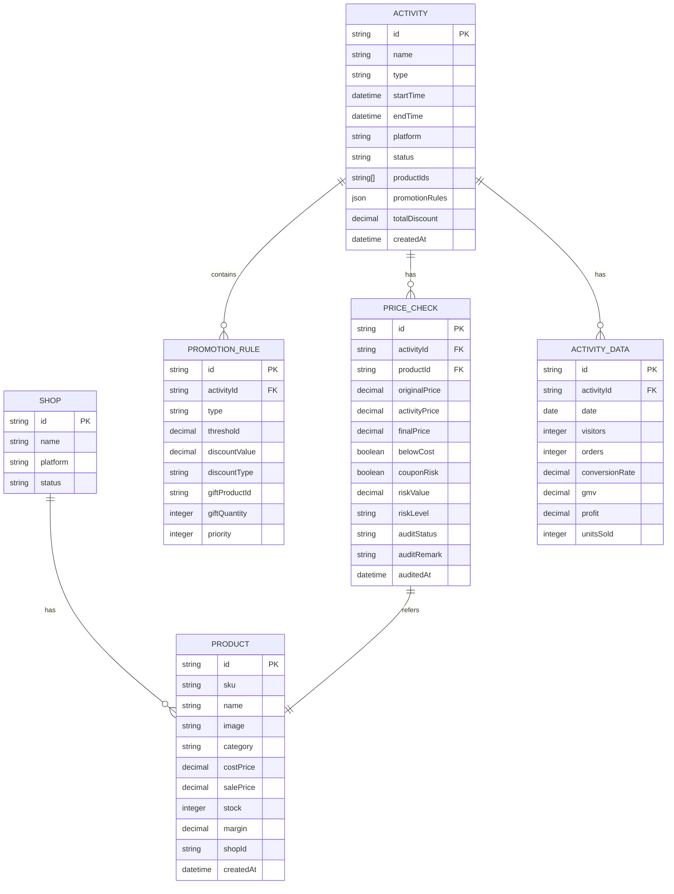

## 1. 架构设计



## 2. 技术描述

- **前端框架**：React@18 + TypeScript@5
- **构建工具**：Vite@5
- **样式方案**：Tailwind CSS@3 + PostCSS
- **路由管理**：React Router@6
- **状态管理**：Zustand@4（轻量级状态管理，替代 Redux）
- **数据可视化**：Recharts@2
- **UI 组件**：Headless UI（无样式组件库）+ Lucide React（图标）
- **表单处理**：React Hook Form@7
- **日期处理**：date-fns@3
- **Excel 导出**：SheetJS (xlsx)@0.18
- **后端**：无后端，使用 Mock 数据 + LocalStorage 持久化
- **数据库**：LocalStorage 存储用户数据、活动配置、审核状态

## 3. 目录结构

```
src/
├── components/          # 共享组件
│   ├── layout/         # 布局组件（侧边栏、顶部栏）
│   ├── ui/             # 基础 UI 组件（按钮、卡片、表格等）
│   └── charts/         # 图表组件
├── pages/              # 页面组件
│   ├── ProductPool/    # 商品池页面
│   ├── ActivityConfig/ # 活动配置页面
│   ├── PriceCheck/     # 价格校验页面
│   └── Dashboard/      # 效果看板页面
├── store/              # 状态管理（Zustand stores）
├── types/              # TypeScript 类型定义
├── data/               # Mock 数据
├── utils/              # 工具函数
│   ├── price.ts        # 价格计算、风险检测
│   ├── export.ts       # 导出功能
│   └── date.ts         # 日期处理
├── hooks/              # 自定义 Hooks
├── App.tsx
├── main.tsx
└── index.css
```

## 4. 路由定义

| 路由路径 | 页面名称 | 权限要求 |
|----------|----------|----------|
| `/` | 商品池页面 | 登录用户 |
| `/products` | 商品池页面 | 登录用户 |
| `/activity/create` | 新建活动配置页面 | 登录用户 |
| `/activity/:id` | 编辑活动配置页面 | 登录用户 |
| `/price-check` | 价格校验页面 | 登录用户 |
| `/price-check/:id` | 单个活动价格校验详情 | 登录用户 |
| `/dashboard` | 效果看板页面 | 登录用户 |
| `*` | 404 重定向到商品池 | - |

## 5. 数据模型

### 5.1 数据模型定义



### 5.2 核心类型定义

```typescript
// 商品
interface Product {
  id: string;
  sku: string;
  name: string;
  image: string;
  category: string;
  costPrice: number;
  salePrice: number;
  stock: number;
  margin: number;
  shopId: string;
  createdAt: string;
}

// 店铺
interface Shop {
  id: string;
  name: string;
  platform: 'taobao' | 'jd' | 'pdd' | 'douyin';
  status: 'active' | 'inactive';
}

// 活动
interface Activity {
  id: string;
  name: string;
  type: 'discount' | 'full_reduce' | 'gift';
  startTime: string;
  endTime: string;
  platform: string;
  status: 'draft' | 'pending' | 'approved' | 'rejected' | 'running' | 'ended';
  productIds: string[];
  promotionRules: PromotionRule[];
  createdAt: string;
}

// 促销规则
interface PromotionRule {
  id: string;
  type: 'full_reduce' | 'discount' | 'gift';
  threshold?: number;
  discountValue: number;
  discountType: 'fixed' | 'percentage';
  giftProductId?: string;
  giftQuantity?: number;
  priority: number;
}

// 价格校验记录
interface PriceCheckRecord {
  id: string;
  activityId: string;
  productId: string;
  originalPrice: number;
  activityPrice: number;
  finalPrice: number;
  belowCost: boolean;
  couponRisk: boolean;
  riskValue: number;
  riskLevel: 'low' | 'medium' | 'high';
  auditStatus: 'pending' | 'approved' | 'rejected';
  auditRemark?: string;
  auditedAt?: string;
}

// 活动数据
interface ActivityDailyData {
  id: string;
  activityId: string;
  date: string;
  visitors: number;
  orders: number;
  conversionRate: number;
  gmv: number;
  profit: number;
  unitsSold: number;
}
```

## 6. 核心算法与业务逻辑

### 6.1 活动价格计算
- 单商品活动价 = 原价 × 折扣率（折扣活动）
- 满减计算：根据订单金额匹配最优档位，减免对应金额
- 叠加计算：活动价 + 店铺券 + 平台券 = 最终到手价

### 6.2 风险检测算法
- **低于成本检测**：最终到手价 < 成本价 → 高风险
- **毛利过低检测**：(最终到手价 - 成本价) / 最终到手价 < 10% → 中风险
- **优惠券叠加检测**：活动价 + 常规优惠券后 < 成本价 → 高风险
- **价格异常检测**：活动价低于历史最低价 30% → 中风险

### 6.3 数据对比逻辑
- 活动期数据 vs 活动前7天同期数据
- 同比去年同期活动数据
- 核心指标：GMV、转化率、客单价、毛利额、毛利率

## 7. 第三方库依赖

```json
{
  "dependencies": {
    "react": "^18.2.0",
    "react-dom": "^18.2.0",
    "react-router-dom": "^6.22.0",
    "zustand": "^4.5.0",
    "recharts": "^2.10.0",
    "@headlessui/react": "^1.7.0",
    "lucide-react": "^0.344.0",
    "react-hook-form": "^7.50.0",
    "date-fns": "^3.3.0",
    "xlsx": "^0.18.5",
    "clsx": "^2.1.0"
  },
  "devDependencies": {
    "typescript": "^5.3.0",
    "vite": "^5.1.0",
    "@vitejs/plugin-react": "^4.2.0",
    "tailwindcss": "^3.4.0",
    "postcss": "^8.4.0",
    "autoprefixer": "^10.4.0"
  }
}
```
